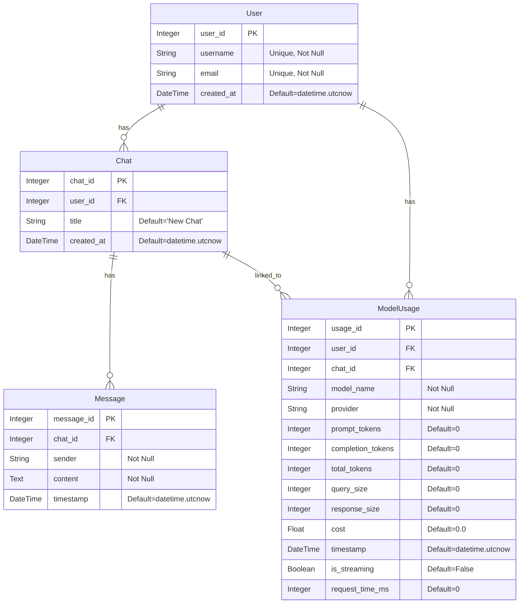

# Entity-Relationship Diagram

```mermaid
erDiagram
    User ||--o{ Chat : has
    User ||--o{ ModelUsage : has
    Chat ||--o{ Message : has
    Chat ||--o{ ModelUsage : linked_to
    
    User {
        Integer user_id PK
        String username "Unique, Not Null"
        String email "Unique, Not Null"
        DateTime created_at "Default=datetime.utcnow"
    }
    
    Chat {
        Integer chat_id PK
        Integer user_id FK
        String title "Default='New Chat'"
        DateTime created_at "Default=datetime.utcnow"
    }
    
    Message {
        Integer message_id PK
        Integer chat_id FK
        String sender "Not Null"
        Text content "Not Null"
        DateTime timestamp "Default=datetime.utcnow"
    }
    
    ModelUsage {
        Integer usage_id PK
        Integer user_id FK
        Integer chat_id FK
        String model_name "Not Null"
        String provider "Not Null"
        Integer prompt_tokens "Default=0"
        Integer completion_tokens "Default=0"
        Integer total_tokens "Default=0"
        Integer query_size "Default=0"
        Integer response_size "Default=0"
        Float cost "Default=0.0"
        DateTime timestamp "Default=datetime.utcnow"
        Boolean is_streaming "Default=False"
        Integer request_time_ms "Default=0"
    }
```